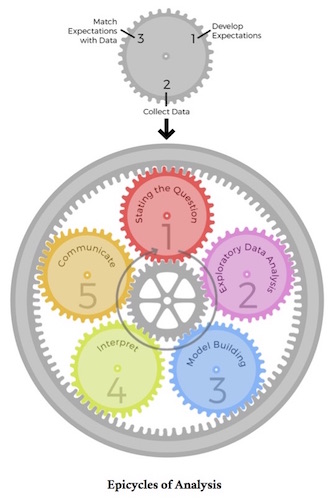

# Introducción
Este documento pretende guiarlo por un proceso más o menos fluido y más o menos simple para aprender [**R**](http://www.re-project.org) y algunas bases de estadística.
Partimos de la base de que usted cumple (o cree cumplir o decide forzarse a cumplir) con las siguientes dos condiciones:

+ No es programador (pero tiene un dominio razonable de un computador), y
+ No tiene mucho conocimiento de estadística.

Este documento _pretende_ ser un abrebocas para dos mundos inmensos, interesantes y complejos: el de la estadística, y el de la ciencia de datos con **R**. Como tal, su objetivo principal es **evangelizar** a la mayor cantidad posible de hispanoparlantes en conceptos de estadística y en el uso de **R** (y, ojalá, alejarlos de Excel!).

Está pensado (y lo iré desarrollando) como un apoyo pedagógico para enseñar a un grupo de ingenieros recién egresados en un entorno empresarial, así que es posible que los ejemplos presentados (y eventualmente los contenidos) correspondan con ese interés primordial. Un corolario de eso es que, al ser un entorno corporativo, no habrá un capítulo sobre la instalación de **R** o [**RStudio**](http://www.rstudio.com). Un segundo corolario es que mantendré nulas o muy cortas las referencias a la história de los diferentes paquetes o programas.

## Qué NO ES este documento
Este documento no es un tratado de estadística. Ni siquiera un libro de texto. Es posible que contenga [numerosos] errores conceptuales y de forma, tanto de estadística como de programación. Este documento no proveerá un _estado del arte_ en ninguna de las dos ramas.

# R y RStudio
R es un programa poderoso para procesar datos, explorarlos y construir documentos de _Ciencia o investigación reproducible_. Es un lenguaje interpretado (esto quiere decir que es posible escribirle en un lenguaje más o menos humano. Sí, inglés, _sorry_). R no es el tipo de software "amigable" al que probablemente usted está acostumbrado (esos de hacer _click_, que tienen todo visual), es un programa que utiliza la línea de comando (más adelante le daré unas razones para preferir la línea de comando sobre los ambientes más visuales). Pero R probablemente se va al extremo, y el usuario promedio pierde visibilidad de lo que se está haciendo, así que RStudio es una alternativa intermedia entre lo visual y lo potente. La idea es utilizar RStudio en todo el proceso.

## La línea de comando
La línea de comando es una pantalla más o menos monocromática en la que el computador espera que usted **ESCRIBA** algo. El énfasis en "escriba" no es gratuito: los clicks del mouse tienen funcionalidad bastante limitada en la ventana de comando (este es un cambio significativo para la mayoría). Para la mayoría de la gente esta es una gran desventaja (lo poco intuitivo), pero tiene unas enormes ventajas también:

+ Ventajas de la línea de comando
  - [Casi] Siempre sabes lo que estás haciendo
  - Puedes registrar los pasos para repetir, exactamente igual, lo que hiciste
  - Puedes consultar los pasos que seguiste en un determinado análisis, para repetirlo, para aprenderlo, para automatizarlo, o para identificar errores (conceptuales o de método)
  - Puedes dejar intactos los archivos de datos crudos para repetir procesamiento de datos o para ajecutar otros análisis.
  - No siempre aceptan tus errores, lo que te permite verlos con facilidad.
  
```
DATOS CRUDOS:
Son los datos originales registrados. Pueden ser generados automáticamente (como los generados por un PLC), o capturados manualmente y luego digitados (como los registros de producción en planta). Son crudos cuando no tienen ninguna modificación.

DATOS PROCESADOS:
Son datos a los que se les ha hecho algún tipo de modificación que los altera (operaciones aritméticas, consolidación, depuración, etc.)
```
Un concepto reiterativo en este curso es el de **reproducibilidad** (ciencia reproducible, investigación reproducible). La reproducibilidad es la capacidad de llegar al mismo resultado, pasando por los mismos pasos intermedios, cuando se parte de los mismos datos crudos y se ejecuta el mismo proceso.

```
La reproducibilidad es prácticamente impensable en un entorno visual de hacer click. Por eso (y otras razones) no utilizamos Excel. R y RStudio nos dan la posibilidad de hacer nuestros análisis totalmente reproducibles al integrar la carga, procesamiento, visualización de información y reporte en un solo documento.
```

# Perdiéndole el miedo a la línea de comando
Una forma de pensar la línea de comando es considerarla una "gran calculadora". En ella podemos dar instrucciones directas al computador, como por ejemplo:

```{r}
2 + 3
```

Cuando escribimos `2+3` vemos el resultado inmediatamente, 5. También nos ofrece otra información, de la que luego haremos sentido (como el `[1]`).

Pero no todo lo que queremos que el computador haga son sumas o restas, queremos operaciones más complejas. Estas se logran mediante el uso de funciones. Las funciones tienen dos componentes: nombre y argumentos. Argumentos son las variables que se "entregan" (usamos más normalmente el verbo "pasar") a la función para que sean procesadas. Excel usa funciones, lo que pasa es que las usa dentro de las celdas y haciendo clicks, pero en su concepto y funcionamiento son idénticas a las de R. Por ejemplo, podemos calcular el máximo entre 3 y 72 (en Excel se puede hacer igual, aunque con frecuencia tendrás el 3 y el 72 como valores de celdas):

```{r}
max(3, 72)
```

Puedes jugar con varias funciones de R que utilizan argumentos numéricos, como `min`, `max`, `sd` y `mean`.
Espero que hayas notado que las funciones tienen nombres en inglés (_mean_ para promedio), y en algunos casos abreviaciones difíciles de enteder si no estás familiarizado (como _sd_ para **S**tandard **D**eviation, o desviación estándar). También habrás notado que estas funciones reciben varios argumentos y aplican la misma función sobre ellos. No todas son así, intenta `sqrt(3, 72)` (_sqrt_ para **SQ**uare **R**oo**t**, o raíz cuadrada).

También podemos aplicar funciones a otros tipos de datos, como texto:

```{r}
substr("paranguaricutirimicuaro", 1, 8)
```

La anterior función saca una parte (sub) de una cadena de texto (string o _str_) entre los caracteres primero (1) y octavo (8).

# Tipos y clases de variables

```
Una variable es una cantidad que varía o cambia. Piensa en el contenido de una celda NO FORMULADA en Excel.
```

R acepta un gran número de tipos y clases de variables. La definición de tipo y clase es un tema relativamente complejo de programación, así que vamos a mantenernos pegados a lo simple. Los datos pueden ser:

+ Numéricos: números enteros o decimales
+ Fechas
+ Lógicos: valores que pueden ser verdadero (`TRUE`) o falso (`FALSE`)
+ Caracter: letras o combinaciones de letras (o números)
+ Factor: es un tipo especial de caracter en el que los datos más o menos se repiten o están confinados a un conjunto finito (como los colores, o los nombres de personas). Aunque es posible trabajar con variables de tipo caracter, hacerlo con factores simplifica muchos procesos!

R es un lenguaje que por defecto está diseñado para trabajar con vectores (un vector es una lista de valores, la forma en la que usualmente vienen los datos). Esto facilita muchas operaciones. Veamos el caso de `sqrt` que nos falló anteriormente:

```{r}
sqrt(c(1, 4, 25, 64))
```

Ya no genera un error, y efectivamente nos da la raíz de los numeros que pasamos como argumentos. La clave está en la función para armar el vector: `c` (no estoy seguro, pero creo que _c_ se refiere a concatenar). Con esta función se pueden armar vectores de todos los tipos:

```{r}
c(1 , 2, 3)
c("a", "b", "c")
c(TRUE, FALSE, TRUE)
```

La clase `factor` es especial porque "entiende" que los valores iguales de una variable son _lo mismo_, lo que facilita varias cosas. Veamos, el vector:

```{r}
c("a", "a", "b", "a")
```

es aparentemente igual al vector

```{r}
factor(c("a", "a", "b", "a"))
```

(note que en este último caso, además de darnos los valores `a a b a`, también nos dice que están en dos "niveles" o categorías: `a b`). Observe la utilidad de esto: si pedimos calcular un resumen de los datos (con la función `summary`), estos son los resultados:

```{r}
summary(c("a", "a", "b", "a"))
summary(factor(c("a", "a", "b", "a")))
```

En el primer caso R nos dice que hay un vector de longitud 4 de tipo caracter y nada más. En el segundo caso, nos indica que hay 3 instancias del nivel `a` y una del `b`!

Un capítulo sobre variables no estaría completo sin hablar del operador de asignación. Hay valores que queremos usar y reusar, así que lo más conveniente es guardarlos (asignarlos) a una variable. Digamos por ejemplo que queremos calcular el máximo, mínimo, promedio, mediana y desviación estándar de un vector de 4 números: `2 4 12 6`. Una alternativa es repetir todos esos números en cada cómputo, la otra es asignarlo a una variable y reciclarla:

```{r}
variable <- c(2, 4, 12, 6)
max(variable)
min(variable)
mean(variable)
median(variable)
sd(variable)
```

El operador para asignar es la "flecha" formada por los caracteres `<-` (R también acepta asignación en la otra dirección, ensaya con `->`).

# El Proceso del Análisis de Datos
En un libro muy interesante, llamado el [Arte de la Ciencia de Datos](https://leanpub.com/artofdatascience), proponen que el proceso para la ciencia de datos es cíclico (de hecho, epicíclico) y que está dividido en 5 etapas: establecer la pregunta, explorar los datos, construir un modelo, interpretar y comunicar; y que cada uno de esos pasos está compuesto por la iteración de 3 actividades: desarrollar expectativas, recoger datos y conectar las expectativas con los datos.



Vamos entonces a correr un ciclo de análisis de datos con unos datos aproximadamente reales de producción de planta.

# Procesando Datos reales

Vamos entonces a comenzar con nuestro epiciclo de análisis de datos. 

## Establecer la Pregunta
Supongamos que nos informan que en la planta hay un proceso en el que trabajan 6 operarios en tres turnos. La compañía (es decir nosotros!) está interesada en saber si la productividad de esa área ha ido en aumento, y si se puede ver algún patrón definido por turno u operario.

### Desarrollar expectativas
Nos han hablado de un archivo de Excel, con datos que fueron registrados primero en papel y luego digitados en Excel. **Esperamos** que los datos tengan, como mínimo, registros que incluyan fecha, operario, turno y producción.

### Recolectar datos
Vamos a cargar los datos desde Excel. Para hacerlo, es necesario instalar un paquete o librería (un paquete es un grupo de funciones que tienen algo en común) que nos permita leer los archivos de Excel.

```{r, eval=FALSE}
install.packages("xlsx")
```

¿Cómo supimos que el nombre del paquete es `xlsx`? Le preguntamos a google "cómo cargar archivos de excel en R", y uno de los paquetes que nos dio fue este (hay otros, pero yo prefiero este. Ustedes se darán cuenta que en cuestión de paquetes es cuestión de probar, comparar y decidir, y que _entre gustos no hay disgustos_).

Carguemos el archivo, asignándolo en una variable:

```{r}
require(xlsx)
# Este primer comando le pide a R que "cargue" la librería xlsx, para que sus funciones estén disponibles.
# a proósito: todo lo que comience con # dentro del código es un comentario y no se ejecuta

produccion <- read.xlsx(file = "archivos/produccionOperario.xlsx", sheetIndex = 1, stringsAsFactors = TRUE, encoding = "UTF-8")
# que hicimos aquí: leimos un archivo y los datos que estaban en él los cargamos a la variable producción. 
# Para leerlo usamos la función read.xlsx, leimos el archivo (file) que está en el folder archivos y que se llama produccionOperario.xlsx, indicamos que la tabla que nos interesa está en la hoja 1, e hicimos dos pedidos adicionales:
# pedimos que las cadenas de texto que encontrara en los datos (strings) las leyera como factores
# pedimos que leyera los datos codificados como UTF-8, la forma en que escribimos en español (para que la tíldes no salgan como caracteres raros).
```

### Conectar Expectativas con los datos
Una vez tenemos cargado el archivo, una buena idea es ver si cargó bien. para eso podemos utilizar los comando `head` y `tail` (cabeza y cola. La razón es que alguna tablas de datos pueden tener encabezados o líneas de totales al final que "dañan" la tabla).

```{r}
head(produccion, 4)
tail(produccion, 4)
```

Aparentemente la tabla está buena, tanto arriba como abajo; sin embargo, es importante verificar que la _estructura_ de los datos (es decir, las clases de las variables) son correctas (puede ocurrir que las fechas _se vean_ bien, pero que estén almacenadas como texto, por ejemplo). Para eso utilizamos el comando `str` (de structure, estructura):

```{r}
str(produccion)
```

Este comando nos arroja una información bastante importante:

+ Nos dice que la tabla es de tipo 'data.frame'. Este tipo es uno de los más comunes. Simplemente es una tabla de datos cuya estructura es así:
  - cada columna es una variable
  - cada fila es un registro
+ Nos dcie que tenemos 33 registros (observaciones) en 4 variables
+ Nos dice que la información en fecha está guardada como fecha (Date), que la información en turno y operario está guardada como factor (esto es el resultado de haber puesto `stringsAsFactors = TRUE` en la función de importación desde Excel), y que las unidades es una variable numérica.

Nuestra expectativa está cumplida con los datos que tenemos!

## Exploración de Datos
Una vez tenemos los datos cargados, y estamos seguros que la información satisface las expectativas, estamos listos para el segundo paso en el epiciclo: la exploración de datos. Esta es una de las etapas más divertidas del procesamiento de datos, **y una que frecuentemente se confunde con la ciencia de datos**.

### Desarrollar expectativas
En esta etapa esperamos que los datos estén:

+ Libres de errores evidentes
+ Que sean representativos
+ Que tengan dispersiones controladas
+ Que tengan distribuciones más o menos normales (para los datos de producción)
+ Queremos además **conocer** nuestros datos, ver relaciones, patrones, tendencias...

### Recolectar datos
Vamos a ver si los datos cumplen o no nuestras expectativas. Los datos que recolectamos aquí **no son** los datos de producción, sino los datos que nos resuelvan las expectativas. Así que veamos:

Para saber si están libres de errores evidentes, podemos utilizar la función resumen `summary`:

```{r}
summary(produccion)
```

Una cosa que nos podría preocupar es la cantidad de registros por fecha y turno que haya, no debería ser más de uno. Para hacerlo podemos usar la función `table` que nos da una tabla de valores rsultado de cruzar dos variables:

```{r}
table(produccion$fecha, produccion$turno)
```

En ese comando introdujimos un elemento importante de R como lenguaje: su capacidad de almacenar objetos. La tabla `produccion` tiene unos objetos (cada variable) y estos pueden ser accesados utilizando el operador `$`. Así las cosas, la expresión `produccion$turno` puede leerse como "la variable turno dentro de la tabla produccion".

Para saber si las dispersiones están controladas y si las distribuciones son aproximadamente normales, podemos usar varias herramientas, pero tal vez la más sencilla sea un histograma. R tiene un paquete de gráficas en su base y un paquete adicional muy potente llamado `ggplot2`. Aunque `ggplot2` tiene una sintaxis inicialmente más compleja, vamos a usar ese e irlo desmitificando poco a poco, para aprovechar su versatilidad, potencia y extensibilidad.

```{r}
hist(produccion$unidades)

require(ggplot2)
# cargamos el paquete

ggplot(produccion, aes(x = unidades))+geom_histogram(bins = 8)
# llamamos la función ggplot sobre la tabla produccion
# establecemos una "estética" (aes, de aesthetic) en la que decimos que la variable que nos interesa es unidades y que la queremos en el eje x
# y finalmente decimos que queremos una capa (geom, de geometry) de tipo histograma con 8 divisiones. Esto puede sonar dantesco al principio, pero nos iremos acomodando, ánimo!
```

En esta etapa nos interesa también dar rienda suelta a nuestra inquietud y --poco sorprendentemente-- explorar los datos. Tal vez la mejor forma de hacerlo sea a través de gráficas, para lo que vamos a usar el [temible] `ggplot2`.

Veamos por ejemplo como fue la producción por fecha:

```{r}
ggplot(produccion, aes(x = fecha, y = unidades))+geom_point()
# pasamos fecha al eje x y unidades al eje y de la estética, y añadimos una capa de puntos...
```

Se ve interesante... hay días de poca dispersión (como enero 6) y otros de mucha dispersión (como enero 8 o enero 13). Esto dispara algunas preguntas, ¿cierto? Sin embargo, no es posible ver cuales son los turnos... ¿habrá alguna tendencia en los turnos? Veamos:

```{r}
ggplot(produccion, aes(x = fecha, y = unidades, color = turno))+geom_point()
# además de x y y, podemos añadir una dimensión adicional utilizando el color!
```

Aparentemente nuestros turnos no son consistentes. En ocasiones el primer turno es el de mayor producción (como en enero 10 y 11), pero en otras es el más bajo (como en enero 5 y 9). Definitivamente turno no explica mucho la variación... ¿Será que el operario muestra algún patrón?

```{r}
ggplot(produccion, aes(x = fecha, y = unidades, color = turno, shape = operario))+geom_point()
# añadimos una cuarta dimensión, el operario, esta vez como forma del punto
```

La grafica ya se torna difícil de interpretar, pero todavía no se ve tendencia. Aparentemente nuestros operarios (y turnos) no son muy consistentes :(

La tendencia que vimos de unidades por fecha no es conclusiva, porque están separados los turnos. Para poder ver la tendencia es necesario consolidar la producción por fecha (sumarla). Para hacerlo, vamos a utilizar el paquete `data.table`. Este es otro paquete con una sintaxis inicialmente intimidante, pero muy potente. ¡Vamos despacio, pero vamos constante!

```{r}
require(data.table)
# cargamos el paquete. ESTA FUE LA ÚLTIMA VEZ QUE EXPLICAMOS ESTO ;)

setDT(produccion)
# Este comando convierte la tabla produccion en una data.table. Una data.table es como una data.frame, pero en esteroides (en realidad es una clase que conserva la clase data.frame también).

produccion[, sum(unidades), by = fecha]
# en este comando estamos usando varias cosas nuevas: el corchete cuadrado [ es el operador clave de las data.table. Dentro de él hay 3 campos principales, separados por comas: el primero es el de filtrar los datos (como está vacío, no estamos filtrando nada). El segundo es el de operar (estamos calculando la suma de la variable unidades). El tercero es el de la variable de agrupación (le estamos diciendo que esa operación la haga por cada fecha)
```

Es difícil determinar la tendencia desde una tabla, así que vamos a graficar eso. Hay dos opciones aquí: una es salvar la tabla anterior a una variable temporal, y la otra es pasar esa expresión directamente a `ggplot` como un argumento. Cuál usar dependerá de lo complejas que sean las expresiones, de qué tan enredado esté tu código y de qué tan propenso seas a confundirte. Vamos por ahora a usar la segunda alternativa:

```{r}
ggplot(produccion[, sum(unidades), by = fecha], aes(x = fecha, y = V1))+geom_point()
# una cosa para estar antento son los nombres de las variables. Como no le dimos un nombre a la operación suma, data.table le pone un nombre por defecto, V1. Ese es el nombre que debemos poner en la estética como y
```

¡Wow! Aparentemente hay dos grupos allí... las producciones hasta el 9 de enero (con excepción del día 5) son "bajas", mientras que las del 10 al 14 son más altas.

Si analizamos, de manera similar, las producciones por turno (recuerden que son comparables, porque atrás vimos que hay exactamente el mismo número de registros por turno), entonces encontramos que el turno de menor producción es el 2:

```{r}
ggplot(produccion[, sum(unidades), by = turno], aes(x = turno, y = V1))+geom_point()
# Una nota intersante aquí: lo que está en el eje x NO ES un número (las fechas se pueden convertir a números), es un factor. R maneja facilmente los factores, entendiéndolos como cateogrías. Lo mismo hará más adelante con los operarios
```

Fíjense que si queremos hacer un cálculo similar para operario, no tiene sentido analizar el _total_ (la suma), sino el promedio (ya que hay diferencia en los turnos trabajados por cada operario). Esto se logra cambiando la operación suma (`sum`) por promedio (`mean`):

```{r}
ggplot(produccion[, mean(unidades), by = operario], aes(x = operario, y = V1))+geom_point()
```

Parece que Alberto tiene dificultades con la máquina...

Desde un punto de vista estadístico (y de control de proceso) nos interesa no sólo la centralidad de los datos (el promedio, por ejemplo), sino la dispersión. Veamos como fue la dispersión por operario utilizando una herramienta de visualización llamada la gráfica de cajas (_boxplot_):

```{r}
ggplot(produccion, aes(x = operario, y = unidades))+geom_boxplot()
```

¿Cómo interpretar esta gráfica? Varios elementos a considerar:

+ Por debajo del borde inferior de la caja están aproximadamente el 25% de los datos (primer cuartil). Por encima del superior están el 25% (tercer cuartil). Esto nos deja con 50% de los datos en el cuerpo de la caja. Por lo tanto:
  - cajas "largas" significan datos dispersos (cajas pequeñas datos concentrados)
+ Los palitos que sobresalen arriba y abajo (barbas o _whiskers_ en inglés) se extienden por un cierto factor que es múltiplo del rango intercuartil (el rango intercuartil es la diferencia entre los valores correspondientes al tercer y primer cuartil), cuando hay datos en ese nuevo rango. Barbas largas nos hablan de dispersión de datos por fuera del rango en el que están concentrados los datos. Observa que las barbas no necesariamente son simétricas en ambas direcciones.
+ Los puntos que están más alejados se llaman puntos extremos (_outliers_ en inglés). Son puntos que pueden considerarse "raros" dentro de los datos (raro no es errado. ¡Evite la tentación de eliminarlos, a menos de que esté plenamente seguro de que es un error!).

Con lo anterior en mente vemos varias cosas: 

+ Pedro es _aparentemente_ el operario más consistente (bajas dispersiones son deseables, porque significan alta repetibilidad de resultados). Sin embargo, recuerde que hay muy pocos registros de Pedro, así que no es correcto saltar tan rápido a esa conclusión (no significa que no _pueda_ ser el más consistente, significa que no podemos afirmarlo todavía. Hablaremos más de esto cuando comentemos sobre hipótesis nula y alterna, valor p, etc.)
+ Alberto tuvo las producciones más bajas en general, mientras que hay poca diferencia entre los otros operarios.
+ José es uno de los operarios con mayor dispersión, Martha la de menor
+ El promedio de José es alto debido a algunos puntos que están alejados de la dispersión por arriba. El de Ximena es bajo debido a algunos puntos alejados por debajo.

¿No es verdad que el promedio solo cuenta una parte pequeñísima de la historia?

Podríamos seguir explorando los datos (es delicioso, ¿no?), pero es necesario movernos con las demás etapas del ciclo.

### Conectar los datos con las Expectativas
Con los datos que nos da `summary` vemos que no hay datos faltantes, que las fechas de los registros corresponden con el periodo de análisis, que los turnos están balanceados, que no hay datos faltantes en los operarios, y que tenemos los 6 que sabemos que trabajan en la máquina. Vemos también que los datos de unidades son números enteros positivos, lo que esperábamos.

Con los datos que nos da `table` vemos que hay exactamente tres turnos por fecha, uno de cada uno. Podemos concluir que nuestra expectativa de no tener errores evidentes ha sido satisfecha.

La representatividad está un poco en duda, sin embargo, porque los datos están muy desbalanceados respecto de los operarios: mientras Ximena trabajó durante 10 turnos, pedro sólo lo hizo 2. Esto no necesariamente nos lleva a descartar los datos, **pero nos obliga a ser cautelosos** si queremos extrapolar las conclusiones obtenidas de los datos de Pedro (un error frecuente es concluir que X es un buen operario o proceso porque tiene una baja dispersión de datos, para luego darnos cuenta de que ¡hay _un único registro_ de él!).

Los histogramas nos muestran que los datos de producción son más o menos normales (la curva se parece a la famosa campana de Gauss) y que tienen una dispersión amplia, pero razonable.